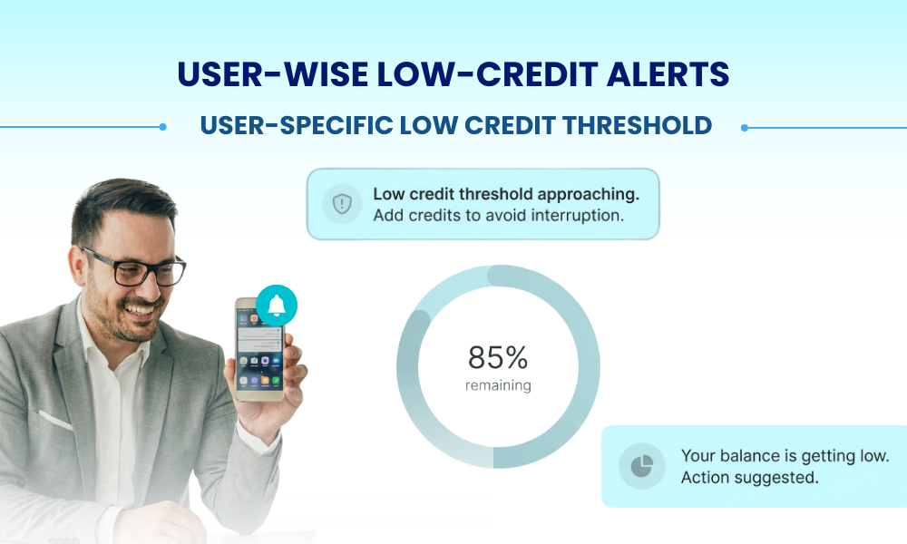

# 📘 **Release Notes: PowerSMPP Version 2.3.0**

We’re excited to introduce a powerful set of enhancements in **PowerSMPP v2.3.0**, designed to give you greater routing precision, stronger delivery resilience, improved billing governance, and smarter automation across your entire messaging workflow.

These updates are now available, and we highly recommend upgrading to unlock the full benefits.

---

## ⭐ Summary of Key Enhancements

- **Gateway-to-Gateway Hopping Mechanism** for higher delivery resilience  
- **Content-Based Routing** for intelligent, dynamic routing decisions  
- **User-Specific Low Credit Threshold Alerts** for improved financial governance  
- **ESME-Specific Routing Rules & Rate Plans** for deeper SMPP-level control  
- **Multiple performance & stability improvements** across SMS and WhatsApp layers  

Every enhancement in this release is tailored to help aggregators, enterprises, and resellers operate high-volume messaging platforms with improved efficiency and reduced operational overhead.

---

# 🔍 Feature Highlights  
## With Real-World Use Cases

---

## 1. **ESME-Specific Routing & Rate Plans**

### 🎯 Fine-Grained SMPP-Level Control  
You can now configure routing rules and pricing **exclusively for ESME accounts**, offering unmatched precision for SMPP-based clients.

### **What’s New**
- ESME-specific routing rules  
- ESME-specific rate plans  
- Routing Simulator updated to support ESME-based decisions  
- Unified behaviour across **Web, API, and SMPP**  

### **Why It Matters**
Many users operate multiple SMPP accounts under one parent profile—each handling different geographies, use cases, or traffic types.  
This enhancement ensures every ESME gets **its own routing logic and pricing model**.

### **Real-World Use Cases**
- **Multi-SMPP Resellers:** Set unique routes and rates for 20+ ESMEs without creating multiple users  
- **Dedicated OTP Routing:** Assign high-priority/premium routes for OTP traffic while keeping marketing traffic cost-efficient  
- **Regional Rate Plans for Aggregators:** Assign different pricing per ESME based on regions  

---

## 2. **Gateway-to-Gateway Hopping Mechanism**

### ⚡ Next-Level Delivery Resilience  
Introducing a smart failover mechanism that automatically switches between up to **four alternate gateways** when the primary is unreachable.

### **What’s New**
- Configure **up to 4 backup gateways**  
- Intelligent retry behaviour based on gateway state  
- Improved global failover handling  
- Enhanced error-based recovery logic  

### **Why It Matters**
Gateway outages, congestion, or regional carrier issues can cause delivery failures.  
This mechanism ensures the system **automatically finds the best possible route**—without manual intervention.

### **Real-World Use Cases**
- **Guaranteed OTP Delivery:** Ensures OTPs are never stuck during peaks  
- **International Aggregators:** Seamless fallback across multiple global gateways  
- **Load Balancing:** Smart traffic distribution across preferred carriers  

---

## 3. **Content-Based Routing**

### 🧠 Intelligent Routing Based on Message Text  
The system now evaluates message content and makes routing decisions using advanced matching conditions.

### **Supported Conditions**
- Contains  
- Starts With  
- Ends With  
- Equals / Not Equals  
- Any  

### **Why It Matters**
Ideal for clients handling multiple message types—OTP, transactional, promotional—under a single account.

### **Real-World Use Cases**
- **OTP vs Promotional Segregation:** OTP → premium routes; Promo → cost-effective routes  
- **WhatsApp → SMS Failover:** Template keywords trigger fallback flows  
- **Industry-Specific Logic:**  
  - Fintech: Route “transaction” messages to high-priority paths  
  - Travel: “Booking/PNR” confirmations → premium routes  
  - Marketing: “Offer/Discount” → promotional gateways  

---

## 4. **User-Specific Low Credit Threshold**

### 📉 Personalized Billing Alerts  
Users can now configure their own credit threshold to ensure alerts match their consumption behaviour.

### **What’s New**
- Per-user threshold settings  
- Automatic fallback to global threshold if unset  
- Email alerts triggered automatically  

### **Why It Matters**
Different users have different traffic patterns.  
A fixed global threshold doesn't suit everyone—this feature ensures alerts fire exactly when expected.

### **Real-World Use Cases**
- **High-Volume Campaign Users:** Prevents campaign disruption due to low balance  
- **Resellers with Downstream Clients:** Configure thresholds based on client category  
- **Corporate Clients:** Align alerting to monthly budget limits  

---

# 📈 Additional Improvements

- Stability & performance enhancements across **SMS** and **WhatsApp** modules  
- Improved routing consistency  
- Smoother processing under high-load conditions  
- Minor bug fixes & system reliability upgrades  

---

## ✅ Summary  
Version **2.3.0** enhances routing intelligence, delivery reliability, billing flexibility, and operational stability—making PowerSMPP more powerful and scalable than ever.

For questions or upgrade guidance, feel free to reach out to your account manager.

